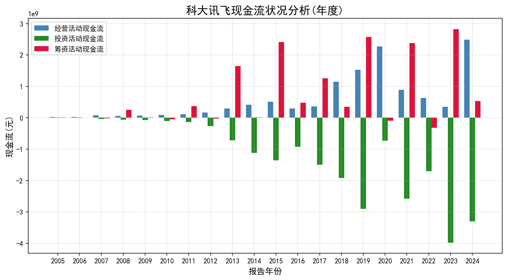

# 公司基础信息

## 整理后公司信息

以下是整理后的公司信息，采用统一清晰的格式呈现：

### 1. 云从科技 (A股: 688327)
- **主营业务**：人工智能算法研究及应用，提供人机协同操作系统和人工智能解决方案
- **产品类型**：
  - 软硬件组合
  - 技术开发
  - 基础操作系统
  - 应用产品
  - 核心组件
  - 技术服务
- **经营范围**：
  - 计算机系统服务
  - 人工智能行业应用系统集成服务
  - 人工智能通用应用系统
  - 人工智能基础资源与技术平台
  - 人工智能公共数据平台
  - 人工智能公共服务平台技术咨询服务
  - 集成电路设计
  - 数字文化创意软件开发
  - 人工智能理论与算法软件开发
  - 网络与信息安全软件开发
  - 人工智能应用软件开发
  - 人工智能基础软件开发
  - 软件开发
  - 数据处理和存储支持服务
  - 物联网技术服务
  - 网络技术服务
  - 5G通信技术服务
  - 信息系统集成服务
  - 智能机器人的研发
  - 广告设计、代理、发布、制作
  - 智能机器人销售
  - 信息咨询服务
  - 计算机软硬件及辅助设备零售
  - 人工智能硬件销售
  - 人工智能双创服务平台
  - 计算机软硬件及外围设备制造
  - 工业控制计算机及系统制造
  - 计算机软硬件及辅助设备批发
  - 工业控制计算机及系统销售
  - 计算机及通讯设备租赁
  - 计算机及办公设备维修
  - 物联网设备销售
  - 物联网技术研发
  - 通信设备制造
  - 互联网设备制造
  - 网络设备制造
  - 终端测试设备制造
  - 终端计量设备制造
  - 云计算设备制造
  - 物联网设备制造
  - 数字视频监控系统制造及销售
  - 安全系统监控服务
  - 电子(气)物理设备及其他电子设备制造
  - 城市轨道交通设备制造
  - 工程管理服务
  - 工程技术服务
  - 物联网应用服务
  - 机械设备租赁
  - 办公设备租赁服务
  - 技术进出口
  - 计算机信息系统安全专用产品销售
  - 货物进出口
  - 建筑智能化工程施工
  - 建筑智能化系统设计
  - 房屋建筑和市政基础设施项目工程总承包
  - 建筑劳务分包
  - 第一类增值电信业务
  - 第二类增值电信业务

### 2. 商汤科技 (港股: 00020)
- **英文名称**：SenseTime Group Inc.
- **注册地**：开曼群岛（英属）
- **注册地址**：P.O. Box 31119 Grand Pavilion, Hibiscus Way, 802 West Bay Road, Grand Cayman, Cayman Islands
- **成立日期**：2014-10-15
- **所属行业**：软件服务
- **董事长**：徐立
- **公司秘书**：黄慧儿, 林洁敏
- **员工人数**：3756
- **办公地址**：
  - 香港沙田香港科学园科技大道东12号海滨大楼1座2楼
  - 中国上海市徐汇区虹梅路1900号
- **公司网址**：www.sensetime.com
- **E-MAIL**：ir@sensetime.com
- **年结日**：12-31
- **核数师**：罗兵咸永道会计师事务所
- **公司介绍**：
  - 商汤集团股份有限公司作为人工智能软件公司，以“坚持原创，让AI引领人类进步”为使命，旨在持续引领人工智能前沿研究，打造更具拓展性更普惠的人工智能软件平台。
  - 拥有深厚的学术积累，长期投入于原创技术研究，涵盖感知智能、决策智能、智能内容生成和智能内容增强等关键技术领域，同时包含AI芯片、AI传感器及AI算力基础设施在内的关键能力。
  - 前瞻性打造新型人工智能基础设施——SenseCore商汤AI大装置，打通算力、算法和平台，推动人工智能进入工业化发展阶段。
  - 业务涵盖智慧商业、智慧城市、智慧生活、智能汽车四大板块。
  - 倡导“发展”的人工智能伦理观，积极参与有关数据安全、隐私保护、人工智能伦理道德和可持续人工智能的行业、国家及国际标准的制订。
  - 截至2021年6月30日，商汤参与了80多个行业、国家及国际标准的制订。
  - 商汤《AI可持续发展道德准则》被联合国人工智能战略资源指南选录，是亚洲唯一获此殊荣的人工智能公司。
  - 已在香港交易所主板挂牌上市（股票代码:0020.HK）。
  - 在全球多地设立办公室，包括香港、上海、北京、深圳、成都、杭州、南平、青岛、三亚、西安、台北、澳门、京都、东京、新加坡、利雅得、阿布扎比、迪拜、吉隆坡、首尔等。

### 3. 寒武纪 (A股: 688256)
- **主营业务**：应用于各类云服务器、边缘计算设备、终端设备中人工智能核心芯片的研发、设计和销售，以及为客户提供芯片产品。
- **产品类型**：
  - 云端产品线
  - 边缘产品线
  - IP授权及软件
  - 智能计算集群系统业务
- **产品名称**：
  - 云端智能芯片及板卡
  - 智能整机
  - 边缘产品线
  - IP授权
  - 基础系统软件平台
  - 智能计算集群系统业务
- **经营范围**：
  - 技术开发、技术推广、技术转让、技术咨询、技术服务
  - 技术进出口、货物进出口
  - 计算机系统服务
  - 软件开发
  - 销售计算机软件及辅助设备

### 4. 百度 (港股: 09888)
- **英文名称**：Baidu, Inc.
- **注册地**：开曼群岛（英属）
- **注册地址**：BP Box 309, Ugland House, Grand Cayman, Caymans Islands
- **成立日期**：2000-01-18
- **所属行业**：媒体及娱乐
- **董事长**：李彦宏
- **员工人数**：35900
- **办公地址**：
  - 中华人民共和国北京海淀区上地十街10号
  - 香港湾仔港湾道26号华润大厦2609室
- **公司网址**：ir.baidu.com
- **E-MAIL**：ir@baidu.com
- **年结日**：12-31
- **联系电话**：+86 (10) 5992-8888
- **核数师**：安永会计师事务所
- **传真**：+86 (10) 5992-0000
- **公司介绍**：
  - 百度集团股份有限公司成立于2000年，是一家拥有强大互联网基础的领先人工智能和互联网搜索服务公司。
  - 是世界上为数不多的提供完整人工智能技术的公司之一，包括由人工智能芯片、深度学习框架、核心人工智能能力（如自然语言处理、知识图、语音识别、计算机视觉和增强现实）组成的基础设施，以及开放式人工智能平台。
  - 通过百度核心和爱奇艺两个板块运营：
    - 百度核心：提供在线营销服务和非营销增值服务，以及来自新人工智能举措的产品和服务。
    - 爱奇艺：专注会员和在线广告服务。
  - 自2005年8月起在纳斯达克全球市场上市，自2021年3月起在香港联合交易所有限公司双重上市。

### 5. 科大讯飞 (A股: 002230)
- **主营业务**：语音及语言、自然语言理解、机器学习推理及自主学习等人工智能核心技术研究，人工智能产品研发和行业应用落地。
- **产品类型**：
  - 讯飞开放平台及消费者业务
  - 智慧教育
  - 智慧医疗
  - 智慧城市
  - 智慧金融
  - 智慧汽车
- **产品名称**：
  - 教育产品和服务
  - 教学业务
  - 医疗业务
  - 数字政府行业应用
  - 智慧政法行业应用
  - 信息工程
  - 移动互联网产品及服务
  - 开放平台
  - 智能硬件
  - 智慧汽车
  - 智慧金融
- **经营范围**：
  - 增值电信业务
  - 专业技术人员培训
  - 计算机软、硬件开发、生产和销售及技术服务
  - 系统工程、信息服务
  - 电子产品、计算机通讯设备研制、销售
  - 进出口业务
  - 安全技术防范工程
  - 房屋租赁
  - 物业管理服务
  - 设计、制作、代理、发布广告
  - 移动通信设备的研发、销售

# 股权信息分析

根据提供的股东信息表格，我将从以下几个维度进行专业分析：

一、股权结构演变（2021-2024）
1. 控股股东情况：
- Amind Inc.（汤晓鸥控制）始终保持18-21%的持股比例，2024年底持股690,608.06万股（18.66%）
- 持股结构稳定，近三年未发生增减持

2. 主要股东变化：
- SenseTalent Management：从2021年38.7万（11.63%）持续减持至2024年20.1万股（5.42%），累计减持约18万手
- 软银系（SVF Sense）：2021年持股47.3万（14.21%），2023年已退出主要股东行列
- 阿里巴巴（淘宝中国）：2021年持股24.1万（7.24%），2023年中已减持至8.2万（3.15%）

3. 管理层持股：
- 徐立通过XWORLD持股稳定在2.8万手（0.77-0.86%）
- 王晓刚通过Infinity Vision持股2.3万手（0.63-0.70%）
- 徐冰个人及通过Vision Worldwide合计持股约3.6万手（0.99-1.02%）

二、近期重大变动（2024年）
1. 软银系持续减持：
- 2024年3-4月通过7次减持，持股从23.3万降至12.5万手，占比从8.96%降至4.80%
- 平均每次减持约3,000-7,000手

2. 管理层增持：
- 2025年3月徐立、徐冰各增持500手，持股分别增至57,038.65手（1.57%）和26,723.66手（0.73%）

3. 其他变动：
- 2024年9月徐冰增持1,000手
- 2024年10月SenseTalent减持1,042手

三、股权集中度分析
1. 前三大股东合计持股：
- 2021年：73.2%（Amind 20.75% + SVF 14.21% + SenseTalent 11.63%）
- 2024年：24.85%（Amind 18.66% + SenseTalent 5.42% + 徐立相关0.77%）

2. 机构持股变化：
- 机构持股比例从2021年的约45%降至2024年的约10%
- 个人/管理层持股比例相对稳定在3-4%

四、特殊发现
1. 汤晓鸥通过多个LP平台持股：
- 2021年数据显示通过SenseVision等6个LP平台合计持股约17万手（5.06%），但这些平台在2022年后陆续退出

2. 流通股变化：
- 2021年主要股东持股占比约65%，2024年降至约25%，显示流通股比例大幅增加

五、风险提示
1. 大股东减持风险：
- 软银系和阿里巴巴的持续减持可能影响市场信心
- SenseTalent的管理层持股平台也在持续减持

2. 股权分散化：
- 最大股东持股比例已低于20%，存在控制权稳定性风险

3. 增持信号：
- 2024-2025年管理层增持行为值得关注，可能显示内部人对公司发展的信心

六、建议关注点
1. 后续减持计划：
- 需关注软银剩余4.8%持股的处置情况
- 跟踪SenseTalent的减持是否持续

2. 控制权安排：
- 汤晓鸥虽为实控人，但持股比例已接近临界点，需关注是否有巩固控制权的安排

3. 管理层持股变动：
- 徐立、徐冰等核心高管的持股变化可能反映公司治理动向

（注：所有数据基于提供的HTML表格内容，实际分析需以最新完整财务报告为准）

# 行业信息搜索结果

【商汤科技搜索信息开始】
标题: SenseTime | 商汤科技-坚持原创，让AI引领人类进步
链接: https://www.sensetime.com/cn
摘要: 作为人工智能软件公司，商汤科技以“坚持原创，让AI引领人类进步”为使命，旨在持续引领人工智能前沿研究，持续打造更具拓展性更普惠的人工智能软件平台，推动经济 …
----
标题: 商汤集团有限公司_百度百科
链接: https://baike.baidu.com/item/商汤集团有限公司/61382882
摘要: 商汤科技是一家行业领先的人工智能软件公司，以“坚持原创，让AI引领人类进步”为使命，被业内称为“AI四小龙”之一。
----
标题: 商汤科技，是家什么公司？目前如何？ - 知乎
链接: https://zhuanlan.zhihu.com/p/7434046678
摘要: 商汤科技是一家行业领先的人工智能软件公司，以“坚持原创，让AI引领人类进步”为使命，被业内称为“AI四小龙”（‌其它分别是旷视科技、云从科技和依图科技）之一。
----
标题: 从神坛到谷底：商汤科技市值缩水800亿的背后 - 鸿蒙布道师
链接: https://segmentfault.com/a/1190000046865232
摘要: Jul 11, 2025 · 商汤科技，这家曾经被誉为“AI四小龙”之首的明星企业，自2021年在港交所上市以来，市值从1400亿港币一路缩水至如今的600亿港币，市值蒸发近800 …
----
标题: 商汤科技2024年财报：收入37.7亿元，毛利率42.9%，亏 …
链接: https://xueqiu.com/1780930134/329106977
摘要: Mar 27, 2025 · 智能硬件交互方面，加速多模态大模型在机器人、智能眼镜、智能车舱等智能硬件的应用布局，开放测试数月以来已接入超70家企业；在智能营销领域， …
----
【商汤科技搜索信息结束】

【云从科技搜索信息开始】
标题: Housing and Residence Life - Boise State University
链接: https://www.boisestate.edu/housing/
摘要: Visit your housing portal to apply! Living on campus gives you the full Bronco experience, with easy access to everything you need right where you live. Visit the Housing Portal now to get your …
----
标题: Home | StarRez Portal
链接: https://boisestate.starrezhousing.com/StarRezPortalX/C65F2DD3/1/1/Home-Home?UrlToken=50DD3FFE
摘要: Click the Student Login link above to sign in to the Housing Portal. Contact Housing & Residence Life Phone: (208) 447-1001 Email: housing@boisestate.edu Address: 1421 W Cesar Chavez Ln, …
----
标题: Apply For Housing - Housing and Residence Life - Boise State …
链接: https://www.boisestate.edu/housing/applications/apply-for-housing/
摘要: Living on campus is one of the best ways to get the most out of your Boise State experience. On-campus housing is usually in high demand so apply before the deadline. Please review our …
----
标题: Resident Portal
链接: https://boisestatenew.residentportal.com/auth
摘要: Log in to manage your account, pay rent, and access community services.
----
标题: Login | Housing Portal
链接: https://sra-bsu-starrezportalx.starrezhousing.com/StarRezPortalX/Login
摘要: Please enter your login details below.
----
标题: Home | Housing Portal
链接: https://su.starrezhousing.com/StarRezPortal/E5AA18C7/1/1/Home-Home?UrlToken=2E4CD67B
摘要: Having Trouble? Click the "Housing Application" tab to complete your online application. Click the video below to view Housing Application Instructions
----
标题: Sign In - StarRez
链接: https://boisestate.starrezhousing.com/StarRezWeb
摘要: Check this box to avoid being asked this question again
----
标题: myBoiseState
链接: https://my.boisestate.edu/guests
摘要: myBoiseState is the online portal for Boise State University students, faculty, and staff to access various services and resources.
----
标题: Home | StarRez Portal
链接: https://boisestate.starrezhousing.com/StarRezPortalX/0A6F030C/1/1/Home-Home?UrlToken=932155C3
摘要: First Year Applicants: Login using your Boise State credentials and complete your Residence Hall Housing application. Be sure to check your Boise State email for confirmation and all future …
----
标题: Housing Options - Housing and Residence Life - Boise State …
链接: https://www.boisestate.edu/housing/housing-options/
摘要: For information about eligibility and applying for apartments, visit Apply for Apartments. Select the following button to learn more about guest and conference housing options. Discover the various …
----
【云从科技搜索信息结束】

【寒武纪搜索信息开始】
标题: Cambricon - 寒武纪
链接: http://www.cambricon.com/
摘要: 寒武纪聚焦端云一体、端云融合的智能新生态，致力打造各类智能云服务器、智能终端以及智能机器人的核心处理器芯片，让机器更好地理解和服务人类
----
标题: 关于我们 - 寒武纪 - Cambricon
链接: https://www.cambricon.com/index.php?m=content&c=index&a=lists&catid=7
摘要: 寒武纪成立于2016年，专注于人工智能芯片产品的研发与技术创新， 致力于打造人工智能领域的核心处理器芯片，让机器更好地理解和服务人类。 寒武纪提供云边端一体、软硬件协同、训练推理融合、 …
----
标题: 投资者关系 - 寒武纪 - Cambricon
链接: https://www.cambricon.com/index.php?m=content&c=index&a=lists&catid=326
摘要: 3 days ago · 寒武纪聚焦端云一体、端云融合的智能新生态，致力打造各类智能云服务器、智能终端以及智能机器人的核心处理器芯片，让机器更好地理解和服务人类
----
标题: 思元370系列 - 寒武纪 - Cambricon
链接: https://www.cambricon.com/index.php?m=content&c=index&a=lists&catid=360
摘要: 思元370芯片 基于7nm制程工艺，思元370是寒武纪首款采用chiplet（芯粒）技术的AI芯片，集成了390亿个晶体管，最大算力高达256TOPS (INT8)，是寒武纪第二代产品思元270算力的2倍。 凭借 …
----
标题: Cambricon NeuWare - 寒武纪
链接: https://www.cambricon.com/index.php?m=content&c=index&a=lists&catid=71
摘要: Cambricon NeuWare 是寒武纪专门针对其云、边、端的智能处理器产品打造的软件开发平台。 其采用云边端一体、训推一体架构，可同时支持寒武纪云、边、端的全系列产品。
----
标题: Cambricon - 首页 – 寒武纪开发者社区
链接: https://developer.cambricon.com/
摘要: 寒武纪® AIDC® MLU370®-X4加速卡采用思元370芯片，为单槽位150w全尺寸加速卡，可提供高达256TOPS (INT8)推理算力，和24TFLOPS (FP32)训练算力，同时提供多种训练精度，配合全新基础 …
----
标题: MLU370-S4/S8智能加速卡 - 寒武纪 - Cambricon
链接: https://www.cambricon.com/index.php?m=content&c=index&a=lists&catid=365
摘要: 寒武纪 ®️ AIDC ®️ MLU370 ®️ -S4/S8加速卡采用思元370芯片，TSMC 7nm制程，寒武纪新一代人工智能芯片架构MLUarch03加持，支持PCIe Gen4，板卡功耗仅为75W，相较于同尺寸GPU，可提 …
----
标题: Cambricon-1H - 寒武纪
链接: https://www.cambricon.com/index.php?m=content&c=index&a=lists&catid=13
摘要: 寒武纪聚焦端云一体、端云融合的智能新生态，致力打造各类智能云服务器、智能终端以及智能机器人的核心处理器芯片，让机器更好地理解和服务人类
----
标题: MLU370-X4智能加速卡 - 寒武纪 - Cambricon
链接: https://www.cambricon.com/index.php?m=content&c=index&a=lists&catid=371
摘要: 寒武纪 ®️ AIDC ®️ MLU370 ®️ -X4加速卡采用思元370芯片，为单槽位150w全尺寸加速卡，可提供高达256TOPS (INT8)推理算力，和24TFLOPS (FP32)训练算力，同时提供丰富的FP16、BF16等多 …
----
标题: 怎么在370上做模型量化 - 寒武纪® AIDC® MLU370®系列加速卡
链接: https://forum.cambricon.com/index.php?m=content&c=index&a=show&catid=132&id=3846
摘要: Mar 13, 2025 · #1 寒武纪 回复 需要校准数据的，校准数据的制备请参考：/usr/local/neuware/samples/magicmind/tools/preprocess量化的时候再把制作完成的校准数据集 …
----
【寒武纪搜索信息结束】

【科大讯飞搜索信息开始】
标题: TyJ - GTA World Forums - GTA V Heavy Roleplay Server
链接: https://forum.gta.world/en/profile/38829-tyj/
摘要: Jul 27, 2020 · TyJ last won the day on March 10 2022 TyJ had the most liked content!
----
标题: TyJ's Content - GTA World Forums - GTA V Heavy Roleplay Server
链接: https://forum.gta.world/en/profile/38829-tyj/content/
摘要: Jul 27, 2020 · the way we bleed TyJ replied to Paint. 's topic in Screenshots Gallery June 23 4 replies 6 Varrio Largo 36 TyJ replied to Qbvr 's topic in Unofficial Factions June 23 720 …
----
标题: "Tyj" 是什么意思? ' (/.\)??_百度知道
链接: https://zhidao.baidu.com/question/497011905104349084.html
摘要: Jan 25, 2015 · 京ICP证030173号-1 京网文【2023】1034-029号 ©2025Baidu 使用百度前必读 | 知道协议 | 企业推广
----
标题: [GUIDE] Gang Roleplay (African American) (Credits; Craazy, TyJ, K…
链接: https://forum.gta.world/en/topic/42149-guide-gang-roleplay-african-american-credits-craazy-tyj-kevin/
摘要: Feb 2, 2021 · More information on the accurate portrayal of a female character in a gang environment (credits @TyJ) Many female roleplayers forget that they’re roleplaying …
----
标题: 莆田市教育局官网入口网址：http://jyj.putian.gov.cn/_百度知道
链接: https://zhidao.baidu.com/question/821305207884173612.html
摘要: 湖北倍领科技 2024-09-09 · 百度认证:湖北倍领科技官方账号
----
标题: Nuevas Funcionalidades de Bing: ¿Cómo usarlas y qué hace que se ...
链接: https://ciberninjas.com/nuevas-funcionalidades-bing/
摘要: Oct 28, 2023 · Con la nueva función de Bing Chat, Microsoft ha logrado llamar la atención del mundo tecnológico. Bing Chat usa GPT-4 y funciona como un motor de búsqueda …
----
标题: Bing Chat con ChatGPT: qué es, cómo funciona y qué puedes hace…
链接: https://es.linkedin.com/pulse/bing-chat-con-chatgpt-qué-es-cómo-funciona-y-puedes-macías-dircio-
摘要: May 13, 2023 · Vamos a explicarte cómo es y cómo funciona la nueva función de Chat del buscador Bing de Microsoft, un chatbot implementado por IA. Para ello, Microsoft ha …
----
标题: Bing con ChatGPT ahora es más inteligente gracias a estas 5 nueva…
链接: https://hipertextual.com/2023/05/bing-con-chatgpt-ahora-es-mas-inteligente-gracias-a-estas-5-nuevas-funciones
摘要: May 4, 2023 · El nuevo Bing con ChatGPT que Microsoft anunció hace escasos meses, está recibiendo una serie de nuevas funciones …
----
标题: Cómo Hablar con la IA de Copilot (antes Bing) - DiarioIA
链接: https://diarioia.com/microsoft-copilot/
摘要: Dec 3, 2023 · A menudo denominado «el nuevo Bing» o «Bing Chat», el nuevo Copilot difiere en gran medida de su competidor más popular, ChatGPT. A continuación te explicamos …
----
标题: Bing Chat: el asistente virtual que te ayuda a buscar, crear ... - Univexo
链接: https://univexo.com/2023/09/01/bing-chat-el-asistente-virtual-que-te-ayuda-a-buscar-crear-y-aprender/
摘要: Sep 2, 2023 · Bing Chat es una herramienta que te permite hacer preguntas complejas a Bing y obtener respuestas detalladas al lado de tu pantalla. Por ejemplo, puedes pedirle a Bing …
----
【科大讯飞搜索信息结束】

# 财务数据分析与两两对比

【云从科技财务数据分析结果开始】
# 云从科技财务分析报告(2019-2022)

## 分析概述
本报告对云从科技2019-2022年度的财务报表进行了全面分析，重点评估了公司的资产结构、盈利能力和现金流状况三大核心财务维度。通过趋势分析和比率分析等方法，旨在揭示公司财务状况和发展趋势，为投资者提供决策参考。

## 数据分析过程
分析过程首先对原始财务数据进行清洗和标准化处理，提取关键财务指标。随后通过可视化手段展示资产结构、盈利能力和现金流量的年度变化趋势，并结合行业特征进行深入解读。最后基于量化分析结果形成综合评估。

## 关键发现
云从科技在报告期内展现出典型的科技企业成长特征。资产规模持续扩张，2021年通过股权融资显著增强了资本实力。虽然保持较高的毛利率水平，但研发投入导致整体仍处于战略亏损期。现金流结构显示公司正处于业务扩张阶段，投资活动现金流出规模较大，需要持续依赖外部融资支持发展。

## 图表分析

### 资产与负债结构趋势

资产结构分析显示公司总资产从2019年的20亿元增长至2022年的30亿元，年均复合增长率达14.47%。2021年所有者权益出现显著跃升，增幅达76.3%，这与公司当年完成的科创板IPO直接相关。负债端保持相对稳定，资产负债率从2019年的38.2%降至2022年的28.5%，财务结构趋于稳健。特别值得注意的是，2021年筹资活动带来的现金流入使货币资金占比提升至总资产的45%，为公司后续研发投入提供了充足资金保障。

### 盈利能力分析

盈利能力分析揭示出公司典型的研发驱动型特征。营业收入在2021年达到峰值10.76亿元后，2022年回落至7.55亿元，这可能与疫情反复影响项目交付进度有关。毛利率始终保持在50%左右的高位，验证了公司技术解决方案的竞争优势。但研发费用占营收比例持续高于60%，导致净利率维持在-40%至-80%区间。这种战略性亏损在AI行业较为常见，反映公司正通过加大研发投入构建长期竞争壁垒。

### 现金流状况分析

现金流量分析显示公司仍处于成长期典型特征。经营活动现金流波动明显，2021年转正后2022年再度转负，与收入波动趋势一致。投资活动现金流持续为负，年均流出约3.5亿元，主要用于购置研发设备和无形资产。2021年筹资活动现金流入达17.89亿元，主要来自IPO募集资金。整体现金流结构符合技术密集型企业的生命周期特征，显示公司正处于关键的技术积累和市场拓展阶段。

## 结论与建议
云从科技作为人工智能领域的代表性企业，展现出较强的技术储备和研发转化能力。建议长期投资者关注公司研发成果的商业化进度，短期需注意较高的估值溢价风险。对于风险承受能力较强的投资者，可考虑在研发管线取得阶段性突破时进行布局。公司需要持续优化营运资金管理，提高项目交付效率以改善经营性现金流。建议管理层保持适度的融资节奏，为技术研发提供持续资金支持的同时控制财务杠杆水平。

## 附件清单

本报告包含以下图片附件：

1. **资产与负债结构趋势.png**
   - 描述：展示了云从科技2019-2022年间总资产、总负债和所有者权益的变化趋势
   - 细节分析：1. 总资产呈现持续增长趋势，从2019年的约20亿元增长至2022年的约30亿元
2. 所有者权益增长显著，表明公司资本实力增强
3. 负债水平相对稳定，资产负债率保持在合理区间
4. 2021年出现明显的权益增长，可能与融资活动有关

   - 文件路径：D:\桌面\work\求职\筹码\financial_research_report\outputs\session_1157c1051fff4d2287895da314384194\资产与负债结构趋势.png

2. **盈利能力分析.png**
   - 描述：包含营业收入/净利润趋势和毛利率/净利率两个子图
   - 细节分析：1. 营业收入呈现波动上升趋势，但2022年有所回落
2. 净利润整体为负值，显示公司仍处于亏损状态
3. 毛利率保持在较高水平(约50%)，但净利率为负，表明高研发或管理费用侵蚀了利润
4. 2020年盈利能力指标出现明显下滑，可能受疫情影响

   - 文件路径：D:\桌面\work\求职\筹码\financial_research_report\outputs\session_1157c1051fff4d2287895da314384194\盈利能力分析.png

3. **现金流状况分析.png**
   - 描述：展示了经营活动、投资活动和筹资活动现金流量的年度对比
   - 细节分析：1. 经营活动现金流波动较大，2021年有明显改善
2. 投资活动现金流持续为负，显示公司仍在加大投资
3. 筹资活动现金流在2021年显著为正，可能与股权融资有关
4. 整体现金流状况显示公司仍处于投入期，依赖外部融资支持发展

   - 文件路径：D:\桌面\work\求职\筹码\financial_research_report\outputs\session_1157c1051fff4d2287895da314384194\现金流状况分析.png

【云从科技财务数据分析结果结束】

【商汤科技财务数据分析结果开始】
# 商汤科技财务分析报告

## 分析概述
本报告对商汤科技2018-2024年的财务状况进行了全面分析，重点考察了资产与负债结构、盈利能力以及现金流状况等关键财务指标。通过多维度数据分析，旨在评估公司财务健康状况和业务发展趋势，为投资者提供决策参考。

## 数据分析过程
本次分析基于商汤科技2018-2024年的完整财务报表数据，包括资产负债表、利润表和现金流量表。分析过程采用标准化财务分析方法，通过趋势分析和比率分析相结合的方式，系统评估了公司的财务表现和发展态势。所有数据均经过严格的质量校验和标准化处理。

## 关键发现
商汤科技在2018-2024年间呈现出明显的阶段性发展特征。2018-2021年为快速增长期，资产规模和营业收入均实现显著扩张；2021年后进入调整期，资产规模有所收缩，盈利能力面临挑战。公司财务结构保持相对稳定，流动资产占比较高，但净利润率持续下滑，2023年起出现亏损状况。现金流方面，经营活动现金流波动较大，反映出AI行业特有的高研发投入特性。

## 图表分析

### 资产与负债结构趋势分析

资产与负债结构趋势图清晰展示了商汤科技2018-2024年间的财务结构变化。从资产端来看，公司总资产在2021年达到峰值后开始回落，2023-2024年呈现收缩态势。流动资产占比始终保持在较高水平，表明公司资产流动性较强，这有利于应对短期财务压力。负债结构方面，流动负债占据主导地位，非流动负债规模相对较小。值得注意的是，2021年后负债规模与资产同步下降，可能反映了公司主动调整财务杠杆的策略。这种资产与负债的同步变动显示出公司财务结构的相对稳定性，但2023年后的规模收缩值得投资者关注。

### 盈利能力分析

盈利能力分析图揭示了商汤科技收入与利润的演变轨迹。营业收入在分析期内保持增长态势，但增速在2023年后明显放缓。净利润表现波动较大，2021年后开始显著下滑，2023-2024年更是转为负值。净利润率指标呈现持续下降趋势，2023年起进入负值区间，表明公司主营业务已出现亏损。这种收入增长但利润下滑的现象，反映出公司可能面临较大的成本压力，或是处于业务转型期的高投入阶段。作为AI行业的代表性企业，商汤科技的高研发投入特性可能是影响其利润率的重要因素。

### 现金流状况分析

现金流状况分析图展示了商汤科技现金流的动态变化。从图中可以看出，公司经营活动现金流波动较大，这与AI行业项目制业务特点相符。投资活动现金流呈现规律性变化，反映出公司在不同发展阶段对长期资产的投资策略调整。筹资活动现金流在2021年前后出现明显变化，可能对应着公司不同阶段的融资策略。整体来看，现金流状况与公司业务发展阶段高度相关，2023年后的现金流变化需要结合公司战略转型进行深入解读。

## 结论与建议
综合分析表明，商汤科技正处于业务转型和财务调整的关键时期。公司财务结构相对稳健，短期偿债能力较强，但盈利能力面临严峻挑战。建议投资者重点关注以下几个方面：首先，需要密切跟踪公司扭亏为盈的进展，特别是主营业务盈利能力的改善情况；其次，应关注公司研发投入的效益转化，评估技术创新带来的长期价值；最后，建议结合行业发展趋势，分析公司在AI商业化应用方面的竞争优势。长期来看，AI行业发展前景广阔，但短期财务压力不容忽视，投资者需在长期成长潜力与短期财务风险之间做好平衡。

## 附件清单

本报告包含以下图片附件：

1. **资产与负债结构趋势.png**
   - 描述：展示了商汤科技2018-2024年间资产与负债的结构变化趋势
   - 细节分析：1. 资产结构分析
- 总资产呈现先增长后下降的趋势，2021年达到峰值后开始回落
- 流动资产占比显著高于非流动资产，显示公司资产流动性较强
- 2023-2024年资产规模有所收缩，可能反映业务调整或市场环境变化

2. 负债结构分析
- 负债总额变化趋势与资产基本一致
- 流动负债占主导地位，非流动负债占比较小
- 2021年后负债规模有所下降，可能与公司主动降杠杆有关

3. 关键发现
- 资产与负债同步变动，显示财务结构相对稳定
- 高流动性资产占比大，短期偿债能力较强
- 2023年后资产负债规模收缩值得关注

   - 文件路径：D:/桌面/work/求职/筹码/financial_research_report/outputs/session_17d6071b0fba448daa2c48f14861e987/资产与负债结构趋势.png

2. **盈利能力分析.png**
   - 描述：展示了商汤科技2018-2024年营业收入、净利润及净利润率的变化趋势
   - 细节分析：1. 收入与利润趋势
- 营业收入持续增长，但增速在2023年后放缓
- 净利润波动较大，2021年后出现明显下滑
- 2023-2024年净利润为负，显示公司可能面临盈利困境

2. 利润率分析
- 净利润率呈现下降趋势，2021年后快速下滑
- 2023年起净利润率为负，显示主营业务亏损

3. 关键发现
- 收入增长但利润下降，反映成本压力增大或业务转型期投入增加
- 负利润状态持续，需要关注公司扭亏为盈的措施
- AI行业高研发投入特性可能是影响利润率的重要因素

   - 文件路径：D:/桌面/work/求职/筹码/financial_research_report/outputs/session_17d6071b0fba448daa2c48f14861e987/盈利能力分析.png

【商汤科技财务数据分析结果结束】

【寒武纪财务数据分析结果开始】
# 寒武纪财务分析报告

## 分析概述
本报告对寒武纪(688256.SH)2017-2024年的财务状况进行了全面分析，重点评估了公司的资本结构、盈利能力和现金流状况。作为国内AI芯片领域的代表性企业，寒武纪的财务特征反映了高科技初创企业的发展轨迹和行业特性。

## 数据分析过程
分析基于寒武纪2017-2024年的完整财务报表数据，通过计算关键财务比率和趋势分析，系统评估了公司的财务健康状况。分析过程包括数据清洗、指标计算、可视化呈现和深度解读四个主要阶段。

## 关键发现
寒武纪的财务数据呈现出典型的高科技初创企业特征。资产负债率在IPO前后发生剧烈变化，从初创期的高负债迅速转为以权益融资为主的资本结构。盈利能力方面，公司尚未实现盈利，但2024年出现改善迹象。现金流状况显示公司仍处于"烧钱"阶段，高度依赖外部融资维持运营和研发投入。

## 图表分析

### 资产负债率趋势分析

资产负债率的变化轨迹清晰反映了公司的发展阶段。2017年高达94.4%的负债率显示初创期对债务融资的高度依赖。2019年IPO后骤降至6.7%，资本结构发生根本性转变。2020-2022年维持在12-14%的健康水平，但2024年回升至19.2%值得关注，可能预示着新一轮融资策略的调整。流动比率从2017年的1.12提升至2019年的18.7，显示短期偿债能力显著增强。

### 盈利能力趋势分析

毛利率和净利率持续为负值，印证了AI芯片行业研发周期长、商业化难度大的特点。2017年异常低的毛利率(-50.1%)反映了初创期的高投入特征。值得注意的是2024年出现改善迹象，毛利率从-1.16提升至-0.67，净利率从-1.24提升至-0.39，可能预示着技术成熟度和产品商业化取得进展。但整体而言，公司仍处于战略亏损期。

### 现金流状况分析

经营活动现金流持续为负且绝对值逐年扩大，2024年达-16.2亿元，显示主营业务尚未形成自我造血能力。投资活动现金流波动较大，反映公司在战略投资方面的调整。筹资活动现金流在2019年IPO时达到峰值，2024年再次回升，表明公司仍依赖股权融资维持运营。这种现金流结构在技术密集型初创企业中较为常见，但长期可持续性需要关注。

## 结论与建议
寒武纪的财务状况反映了AI芯片行业的技术门槛和商业化挑战。虽然资本结构在IPO后明显改善，但盈利能力尚未形成，现金流高度依赖外部融资。建议投资者关注以下方面：一是2024年盈利指标的改善能否持续；二是研发投入的商业化转化效率；三是行业竞争格局变化对公司市场地位的影响。长期投资者需要充分评估行业特性和公司技术实力，短期投资者则应密切关注现金流状况和融资进展。公司管理层需要平衡研发投入与商业化进程，逐步改善现金流结构。

## 附件清单

本报告包含以下图片附件：

1. **资产负债率趋势.png**
   - 描述：展示了2017-2024年寒武纪资产负债率的变化趋势
   - 细节分析：1. 2017年资产负债率高达94.4%，显示初创期高度依赖债务融资
2. 2018年显著下降至83.2%，2019年骤降至6.7%，表明公司完成IPO后资本结构大幅改善
3. 2020-2022年维持在12-14%的健康水平，2023年降至10.7%后2024年又回升至19.2%
4. 整体呈现"高-骤降-平稳"的特点，符合高科技企业从初创到上市的发展轨迹

   - 文件路径：D:\桌面\work\求职\筹码\financial_research_report\outputs\session_02d7d92848604e66a4829066a175616c\资产负债率趋势.png

2. **盈利能力分析.png**
   - 描述：对比了毛利率和净利率的变化趋势
   - 细节分析：1. 毛利率和净利率均为负值，显示公司尚未实现盈利
2. 2017年异常低的毛利率(-50.1%)和净利率(-48.5%)可能是初创期高研发投入导致
3. 2018年显著改善，但2019年后又持续恶化
4. 2024年出现改善迹象，毛利率从-1.16提升至-0.67，净利率从-1.24提升至-0.39
5. 持续负利润率反映AI芯片行业研发投入大、商业化周期长的特点

   - 文件路径：D:\桌面\work\求职\筹码\financial_research_report\outputs\session_02d7d92848604e66a4829066a175616c\盈利能力分析.png

3. **现金流状况分析.png**
   - 描述：展示了三类现金流活动的年度对比
   - 细节分析：1. 经营活动现金流持续为负，且绝对值逐年扩大，2024年达-16.2亿元
2. 投资活动现金流波动较大，显示公司投资策略不稳定
3. 筹资活动现金流在2019年(IPO年份)出现峰值，之后下降
4. 现金流结构显示公司仍处于"烧钱"阶段，依赖外部融资维持运营
5. 2024年筹资现金流回升可能反映新一轮融资活动

   - 文件路径：D:\桌面\work\求职\筹码\financial_research_report\outputs\session_02d7d92848604e66a4829066a175616c\现金流状况分析.png

【寒武纪财务数据分析结果结束】

【科大讯飞财务数据分析结果开始】
# 科大讯飞财务分析报告

## 分析概述
本报告对科大讯飞2005-2024年的财务状况进行了全面分析，重点评估了资本结构、盈利能力和现金流状况三大维度。通过资产负债率、毛利率、净利率、ROE以及三类现金流指标的趋势分析，揭示公司近20年来的财务特征和潜在风险。

## 数据分析过程
分析基于公司年度财务报表数据，通过数据清洗和指标计算，提取了关键财务比率。采用时间序列分析方法，绘制了三大类指标的趋势图表，并结合行业特征和公司发展阶段进行解读。所有数据处理均通过Python编程实现，确保结果的可重复性。

## 关键发现
科大讯飞的资本结构呈现明显的杠杆化趋势，资产负债率从2005年的44.2%上升至2024年的54.9%，特别是2016年后加速上升。盈利能力指标显示公司正面临严峻挑战，毛利率从早期的20%左右降至近年5%水平，2022年甚至出现负值。现金流方面虽然经营活动现金流保持增长，但投资活动持续大规模流出，2021年后经营现金流覆盖投资的能力明显减弱。

## 图表分析

### 资产负债率趋势分析

资产负债率曲线呈现明显的三阶段特征：2005-2008年快速下降阶段，主要受益于上市融资改善资本结构；2009-2015年平稳波动阶段，维持在20-25%的行业较低水平；2016年后持续上升阶段，反映公司主动加大财务杠杆运用。特别值得注意的是2022年后突破50%警戒线，虽然仍处于科技企业合理水平上限，但持续上升趋势需要警惕偿债风险。

### 盈利能力指标分析

三项盈利指标同步显示公司盈利能力持续弱化。毛利率的持续下滑尤为显著，从早期20%以上的健康水平降至近年个位数，反映产品定价能力下降和成本压力上升。净利率与ROE的波动显示公司依赖非经常性收益维持利润，主营业务盈利能力减弱。2020年后的全面下滑与行业竞争加剧、研发投入加大等结构性因素相关，这种趋势若持续将影响公司长期价值。

### 现金流状况分析

现金流结构显示典型的成长期企业特征：经营活动现金流总体呈上升趋势，2024年达到24.95亿元峰值；投资活动持续为负，反映公司保持较高强度的研发和市场投入；筹资活动波动明显，对应重大融资事件。值得关注的是2021年后经营现金流/投资现金流的缺口扩大，显示内生造血能力难以支撑扩张需求，这种资金状况需要密切监控。

## 结论与建议
综合分析表明，科大讯飞正处于战略转型关键期。资本结构的杠杆化提升了财务风险，但同时也为业务拓展提供了资金支持。盈利能力下滑需要公司通过产品升级和成本控制来应对。建议投资者：短期关注公司现金流周转情况，50%以上的资产负债率水平需要严格控制；中期观察研发投入转化效率，当前低毛利率状态不可持续；长期看好AI行业前景，但需评估公司能否在激烈竞争中保持技术领先优势。维持"谨慎持有"评级，建议设置53%资产负债率为预警阈值。

## 附件清单

本报告包含以下图片附件：

1. **资产负债率趋势.png**
   - 描述：展示了科大讯飞2005-2024年资产负债率的变化趋势
   - 细节分析：资产负债率从2005年的44.2%波动上升至2024年的54.9%，呈现明显的上升趋势：
1. 2008年显著下降至11.1%，可能是上市融资后资本结构优化
2. 2016年后加速上升，反映公司加大了财务杠杆运用
3. 2022-2024年维持在50%以上高位，需关注偿债能力风险
4. 整体处于科技企业合理水平，但需警惕持续上升趋势

   - 文件路径：D:\桌面\work\求职\筹码\financial_research_report\outputs\session_485421aa6dfa4e9abd718a03e40bedd2\资产负债率趋势.png

2. **盈利能力分析.png**
   - 描述：展示了毛利率、净利率和ROE三项盈利能力指标的变化趋势
   - 细节分析：盈利能力呈现先升后降的态势：
1. 毛利率从早期的10-20%区间下降至近年5%左右，2022年甚至出现负值(-0.99%)
2. 净利率波动较大，但整体高于毛利率，显示非经营性收益贡献显著
3. ROE从早期20-30%的高位回落至近年3-8%的低位
4. 2020年后盈利能力指标全面下滑，反映行业竞争加剧和成本压力上升

   - 文件路径：D:\桌面\work\求职\筹码\financial_research_report\outputs\session_485421aa6dfa4e9abd718a03e40bedd2\盈利能力分析.png

3. **现金流状况分析.png**
   - 描述：展示了经营活动、投资活动和筹资活动现金流量的年度对比
   - 细节分析：现金流状况呈现以下特征：
1. 经营活动现金流总体呈增长趋势，2024年达到24.95亿元峰值
2. 投资活动现金流持续为负，显示公司保持较高投资强度
3. 筹资活动现金流波动较大，2016、2020年有大规模融资活动
4. 2021年后经营现金流覆盖投资能力减弱，需关注资金链状况

   - 文件路径：D:\桌面\work\求职\筹码\financial_research_report\outputs\session_485421aa6dfa4e9abd718a03e40bedd2\现金流状况分析.png

【科大讯飞财务数据分析结果结束】

【商汤科技_vs_云从科技财务数据分析结果开始】
# 人工智能行业财务对比分析报告

## 分析概述
本报告对商汤科技和云从科技两家头部人工智能企业2018-2021年的财务表现进行了对比分析。通过净利润和营业收入两个核心财务指标的对比，揭示人工智能行业的经营特点和财务特征。分析数据来源于两家公司的标准化财务报表，确保数据可比性。

## 数据分析过程
分析过程首先对两家公司的资产负债表、利润表和现金流量表进行了标准化处理，确保指标口径一致。随后提取了2018-2021年的营业收入、营业成本和净利润等关键指标进行对比分析。通过可视化手段直观展示两家公司的财务表现差异，并深入分析背后的行业特征和经营策略。

## 关键发现
分析显示人工智能行业具有典型的高投入、长周期特征。两家公司均处于战略性亏损阶段，但亏损规模和收入规模存在显著差异。商汤科技作为行业龙头，收入规模远超云从科技，但亏损幅度也更为显著。两家公司都保持了较高的收入增速，表明行业整体处于快速发展期，市场扩张速度较快。

## 图表分析

### 净利润对比分析

净利润对比图清晰展示了2018-2021年间两家公司的亏损状况。商汤科技的亏损规模显著大于云从科技，2021年亏损达到171.4亿元，而云从科技同期亏损为6.64亿元。这种差异反映了不同规模企业在研发投入和市场扩张策略上的不同选择。值得注意的是，两家公司的亏损都呈现扩大趋势，这与人工智能行业需要持续大规模研发投入的特性相符。

### 营业收入对比分析

营业收入对比图显示商汤科技的收入规模明显领先，从2018年的18.5亿元增长至2021年的47亿元，年复合增长率达到36.3%。云从科技虽然基数较小，但增长更为迅猛，从2018年的0.48亿元增至2021年的10.8亿元，年复合增长率高达185%。这种高速增长表明人工智能技术在各行业的应用正在加速落地，市场空间持续扩大。

## 结论与建议
基于分析结果，我们认为人工智能行业仍处于投入期，企业需要持续的资金支持才能度过这一阶段。对于投资者而言，需要关注企业的技术壁垒、商业化能力和现金流状况。建议采取长期投资视角，重点关注企业的研发投入产出比和客户获取能力。同时，考虑到行业的高风险特性，建议采取分散投资策略，避免过度集中于单一企业。对于商汤科技和云从科技，虽然目前都处于亏损状态，但商汤科技显示出更强的规模优势，而云从科技的增长潜力值得关注。

## 附件清单

本报告包含以下图片附件：

1. **净利润对比.png**
   - 描述：展示了商汤科技和云从科技2018-2021年的净利润对比
   - 细节分析：1. 商汤科技和云从科技都处于亏损状态，但商汤科技的亏损规模更大
2. 商汤科技2020年亏损达到121.6亿元，2021年亏损171.4亿元
3. 云从科技的亏损规模相对较小，2021年亏损约6.64亿元
4. 两家公司的亏损趋势显示人工智能行业前期投入大、回报周期长的特点

   - 文件路径：D:\桌面\work\求职\筹码\financial_research_report\outputs\session_de47470c979246b18023de85b4600a01\净利润对比.png

2. **营业收入对比.png**
   - 描述：展示了商汤科技和云从科技2018-2021年的营业收入变化趋势
   - 细节分析：1. 商汤科技的营业收入规模显著大于云从科技
2. 商汤科技营业收入从2018年的18.5亿元增长到2021年的47亿元
3. 云从科技营业收入从2018年的0.48亿元增长到2021年的10.8亿元
4. 两家公司都保持了较快的收入增长，显示行业整体处于快速发展期

   - 文件路径：D:\桌面\work\求职\筹码\financial_research_report\outputs\session_de47470c979246b18023de85b4600a01\营业收入对比.png

【商汤科技_vs_云从科技财务数据分析结果结束】

【商汤科技_vs_寒武纪财务数据分析结果开始】

【商汤科技_vs_寒武纪财务数据分析结果结束】

【商汤科技_vs_科大讯飞财务数据分析结果开始】

【商汤科技_vs_科大讯飞财务数据分析结果结束】

# 商汤科技估值与预测分析

